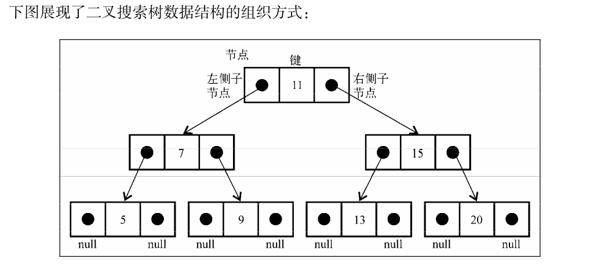

# 树

**树的相关术语**
- 一个树结构包含一系列存在父子关系的节点。每个节点都有一个父节点(除了顶部的第一个节点)以及零个或者多个子节点
- 树的顶部叫做根节点
- 树的每个元素叫做节点
- 节点分为内部节点和外部节点
- 没有子元素的叫做外部节点或者叶节点
- 子树(由节点和它的后代构成)
- 节点的一个属性是深度，节点的深度取决于祖先节点的数量。
- 树的高度取决于节点深度的最大值
  
  根节点在第0层，子节点在第1层。以此类推....

## 二叉搜索树
> 二叉树的节点最多只能有两个。二叉搜索树(BST)是二叉树的一种，只允许左节点比父节点小，右节点比父节点大或者等于的值。



二叉搜索树有两个节点一个指向左子节点，一个指向右子节点。

# 树的插入操作
```
    // 向树插入一个键
    insert(key){
        let newNode = new Node(key);

        if(this.root==null){
            this.root = newNode;
        }else{
            this.insertNode(this.root,newNode);
        }
    }

    insertNode(node , newNode){
        // 无限递归寻找 空的节点 但是 其中还需要判断 值的大小再放
        if(newNode.key < node.key){
            if(node.left === null){
                node.left = newNode;
            }else{
                this.insertNode(node.left,newNode);
            }
        }else{
            if(node.right === null){
                node.right = newNode;
            }else{
                this.insertNode(node.right,newNode);
            }
        }
    }
```